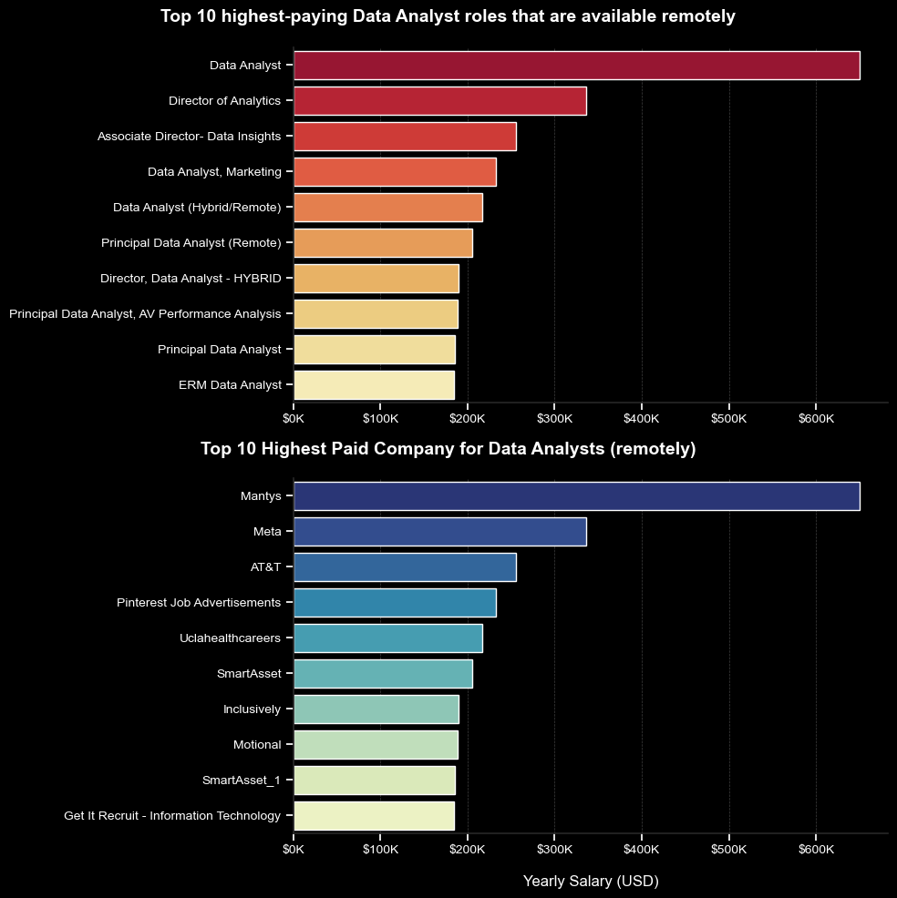
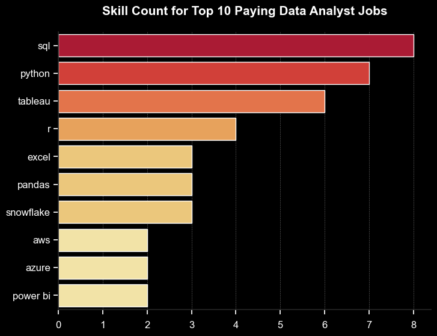
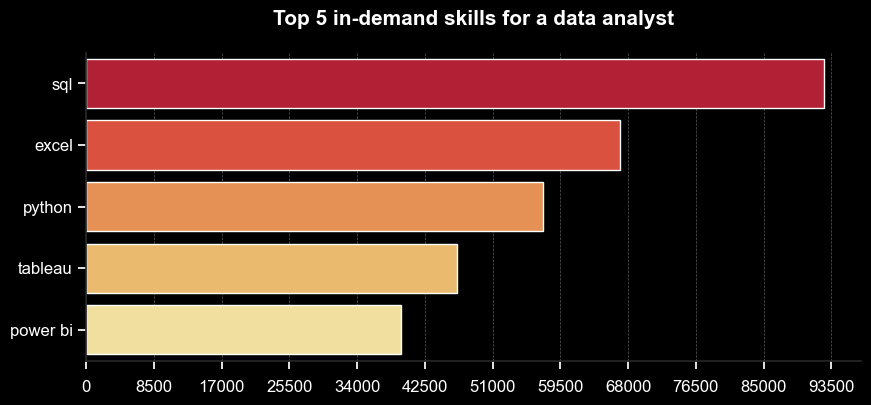

# Introduction

📊 Explore the data job market! This project focuses on data analyst roles, highlighting 💰 the highest-paying positions, 🔥 in-demand skills, and 📈 where high demand meets high salary in data analytics.

🔍 All SQL queries available here: [project_sql folder](/sql_project/).

# Background

### The questions that were intended to be answered through this project:
1. What are the top-paying data analyst jobs?
2. What skills are required for these top-paying jobs?
3. What skills are most in demand for data analysts?
4. Which skills are associated with higher salaries?
5. What are the most optimal skills to learn?

# Tools Used

- **SQL:** Querying, managing, and manipulating data in relational database systems.
- **PostgreSQL:** Managing, storing, and querying structured data efficiently in relational databases.
- **Visual Studio Code:** Code editor for writing, editing various programming languages and scripts.
- **Git & GitHub:** Version control and collaborative development, allowing users to track changes and share code efficiently.
- **Python (Pandas, Matplotlib, Seaborn):** Visualization.

# The Analysis

### 1. Top Paying Data Analyst Jobs

To identify the highest-paying positions, data analyst roles were filtered by average annual salary and location, with a focus on remote job opportunities. This query highlights the top-paying prospects in the field.

``` SQL
SELECT
    job_id,
    job_title,
    job_location,
    job_schedule_type,
    salary_year_avg,
    job_posted_date,
    name AS company_name
FROM
    job_postings_fact
LEFT JOIN company_dim ON job_postings_fact.company_id = company_dim.company_id
WHERE
    job_title_short = 'Data Analyst' AND
    job_location = 'Anywhere' AND
    salary_year_avg IS NOT NULL
ORDER BY 
    salary_year_avg DESC
LIMIT 10;
```

``` Python
fig, ax = plt.subplots(2, 1, figsize=(10, 10), facecolor="black")
sns.despine()
sns.set_theme(style="ticks")

palette= sns.color_palette("YlOrRd", n_colors=10)
sns.barplot(data=df_1, x="salary_year_avg", y="job_title", ax=ax[0], hue="salary_year_avg", palette=palette, legend=False)

ax[0].grid(axis="x", color="gray", linestyle="--", linewidth=0.5, alpha=0.5, zorder=0)
ax[0].set_title(" ", pad=20)
ax[0].set_ylabel("")
ax[0].set_xlabel("")
ax[0].xaxis.set_major_formatter(plt.FuncFormatter(lambda x, _: f"${int(x/1000)}K"))

ax[0].set_facecolor("black")
ax[0].tick_params(axis='x', colors='white', labelsize=10)  
ax[0].tick_params(axis='y', colors='white', labelsize=10)  

fig.text(0.5, 0.97, "Top 10 highest-paying Data Analyst roles that are available remotely", color='white', fontweight='bold', ha='center', fontsize=14)


palette1= sns.color_palette("YlGnBu", n_colors=10)
sns.barplot(data=df_2, x="salary_year_avg", y="company_name", ax=ax[1], hue="salary_year_avg", palette=palette1, legend=False)

ax[1].grid(axis="x", color="gray", linestyle="--", linewidth=0.5, alpha=0.5, zorder=0)
ax[1].set_title(" ", pad=20)
ax[1].set_ylabel("")
ax[1].set_xlabel("Yearly Salary (USD)", color="white", fontsize=12, labelpad=15)
ax[1].set_xlim(ax[0].get_xlim())
ax[1].xaxis.set_major_formatter(plt.FuncFormatter(lambda x, _: f"${int(x/1000)}K"))

ax[1].set_facecolor("black")
ax[1].tick_params(axis='x', colors='white', labelsize=10)  
ax[1].tick_params(axis='y', colors='white', labelsize=10)  

fig.text(0.5, 0.495, "Top 10 Highest Paid Company for Data Analysts (remotely)", color='white', fontweight='bold', ha='center', fontsize=14)


fig.tight_layout()
plt.show()
```

**Here’s an overview of the leading data analyst positions in 2023:**
- **Significant Salary Variation:** The top 10 highest-paying data analyst roles range from $184,000 to $650,000, highlighting substantial earning potential in the industry.
- **Variety of Employers:** Organizations such as SmartAsset, Meta, and AT&T offer competitive salaries, indicating widespread demand across various sectors.
- **Diverse Job Titles:** There is a wide range of job titles, from Data Analyst to Director of Analytics, showcasing the different roles and specializations within data analytics.


*Bar graph visualizing the salary for the top 10 salaries for data analysts (remotely)*

Full code to Visualization available here: 
[Top Paying Data Analyst Jobs Visualization](/Graphs/1_top_paying_jobs.ipynb)

### 2. Skills for Top Paying Jobs

To identify the skills needed for top-paying jobs, job postings were combined with skills data, offering insights into what employers prioritize for high-compensation positions.

``` SQL
WITH top_paying_jobs AS (

SELECT
    job_id,
    job_title,
    salary_year_avg,
    name AS company_name
FROM
    job_postings_fact
LEFT JOIN company_dim ON job_postings_fact.company_id = company_dim.company_id
WHERE
    job_title_short = 'Data Analyst' AND
    job_location = 'Anywhere' AND
    salary_year_avg IS NOT NULL
ORDER BY 
    salary_year_avg DESC
LIMIT 10
)

SELECT 
    skills_dim.skill_id,
    skills_dim.skills,
    COUNT(skills_dim.skill_id) AS skill_count,
    PERCENTILE_CONT(0.5) WITHIN GROUP (ORDER BY salary_year_avg) AS median_salary
FROM 
    top_paying_jobs
INNER JOIN skills_job_dim ON top_paying_jobs.job_id = skills_job_dim.job_id
INNER JOIN skills_dim ON skills_job_dim.skill_id = skills_dim.skill_id
GROUP BY 
    skills_dim.skill_id
ORDER BY
    skill_count DESC,
    median_salary DESC
LIMIT 10;
```

``` Python
plt.figure(figsize=(8, 6), facecolor="black")

palette= sns.color_palette("YlOrRd", n_colors=6)

sns.set_theme(style="ticks")
sns.barplot(data=job_skills, x="skill_count", y="skills", hue="skill_count", palette=palette, legend=False)
sns.despine()

ax = plt.gca()  
ax.set_facecolor("black")  

plt.grid(axis="x", color="gray", linestyle="--", linewidth=0.5, alpha=0.7, zorder=0)
plt.title("Skill Count for Top 10 Paying Data Analyst Jobs", color='white', fontsize=15, fontweight='bold', pad=20)  
plt.ylabel("")  
plt.xlabel("")  

ax.tick_params(axis='x', colors='white', labelsize=12)  
ax.tick_params(axis='y', colors='white', labelsize=12)  
ax.xaxis.set_tick_params(pad=8)

plt.show()
```
**Here's the breakdown of the most demanded skills for the top 10 highest paying data analyst jobs in 2023:**
- **SQL** dominates the list, being the most requested skill, with a count of 8, underscoring its foundational importance in data analysis.
- **Python** is closely following, with a count of 7, reflecting its widespread use in data manipulation and analysis.
- **Tableau**, a popular data visualization tool, appears 6 times, emphasizing the demand for skills in presenting data insights.
- **R** are next, with being listed 4 times, showcasing their relevance in statistical analysis and data management.
- **Excel** appears 3 times, indicating its continued importance for data management and analysis tasks.
- **Pandas**, a Python library, has a count of 3, highlighting its significance in data processing tasks.
- **Snowflake**, a cloud-based data warehousing tool, also appears 3 times, indicating the growing need for cloud-based data solutions.
- **AWS, Azure, and Power BI** each have 2 mentions, pointing to the importance of cloud computing and business intelligence tools in high-paying data analyst roles.

In summary, the chart reflects that technical proficiency in programming (SQL, Python), data visualization (Tableau, Power BI), and cloud platforms (AWS, Azure, Snowflake) is critical for landing top-paying data analyst jobs.



*Bar graph visualizing the count of skills for the top 10 paying jobs for data analysts*

Full code to Visualization available here: [Top Paying Job Skills Visualization](Graphs/2_top_paying_job_skills.ipynb)

### 3. In-Demand Skills for Data Analysts


*Bar graph visualizing top 5 in-demand skills for Data Analyst*

Full code to Visualization available here: [Top Indemand Skills](Graphs/3_top_indemand_skills.ipynb)

### 4. Skills Based on Salary

### 5. Most Optimal Skills to Learn

# Conclusions

### Insights 

### Closing Thoughts 