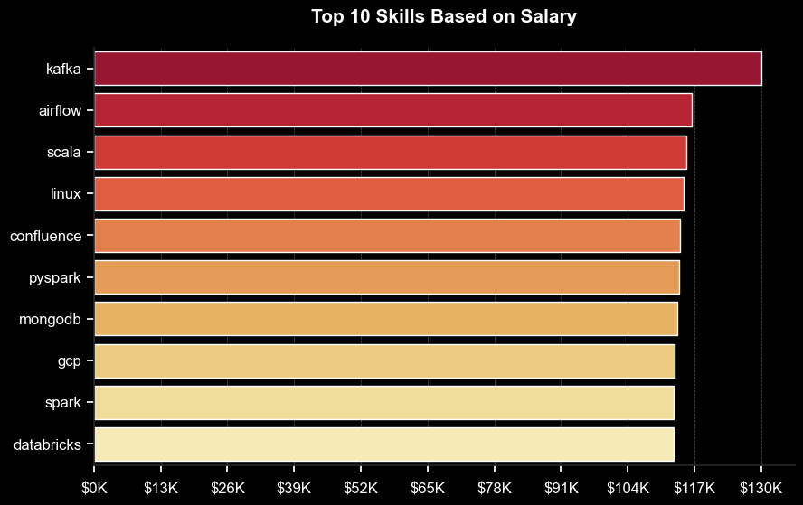
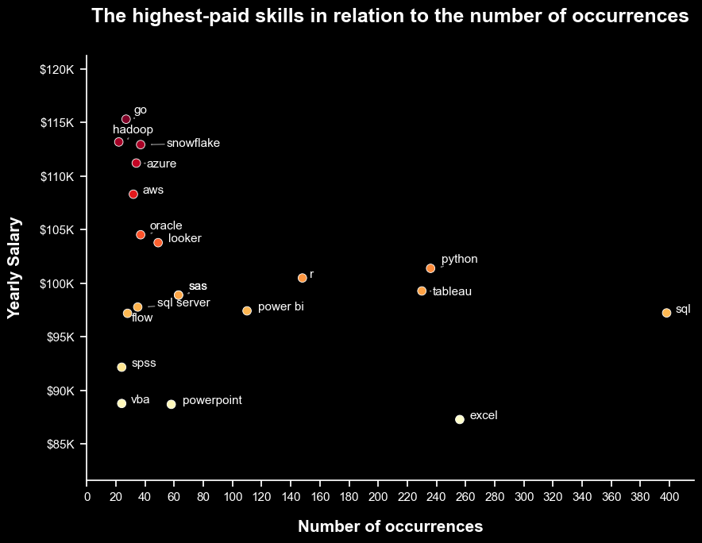

# Introduction

📊 Explore the data job market! This project focuses on data analyst roles, highlighting 💰 the highest-paying positions, 🔥 in-demand skills, and 📈 where high demand meets high salary in data analytics.

🔍 All SQL queries available here: [project_sql folder](/sql_project/).

# Background

### The questions that were intended to be answered through this project:
1. What are the top-paying data analyst jobs?
2. What skills are required for these top-paying jobs?
3. What skills are most in demand for data analysts?
4. Which skills are associated with higher salaries?
5. What are the most optimal skills to learn?

# Tools Used

- **SQL:** Querying, managing, and manipulating data in relational database systems.
- **PostgreSQL:** Managing, storing, and querying structured data efficiently in relational databases.
- **Visual Studio Code:** Code editor for writing, editing various programming languages and scripts.
- **Git & GitHub:** Version control and collaborative development, allowing users to track changes and share code efficiently.
- **Python (Pandas, Matplotlib, Seaborn):** Visualization.

# The Analysis

### 1. Top Paying Data Analyst Jobs

To identify the highest-paying positions, data analyst roles were filtered by average annual salary and location, with a focus on remote job opportunities. This query highlights the top-paying prospects in the field.

``` SQL
SELECT
    job_id,
    job_title,
    job_location,
    job_schedule_type,
    salary_year_avg,
    job_posted_date,
    name AS company_name
FROM
    job_postings_fact
LEFT JOIN company_dim ON job_postings_fact.company_id = company_dim.company_id
WHERE
    job_title_short = 'Data Analyst' AND
    job_location = 'Anywhere' AND
    salary_year_avg IS NOT NULL
ORDER BY 
    salary_year_avg DESC
LIMIT 10;
```

| Job Title                          | Company Name                | Yearly Salary |
|------------------------------------|-----------------------------|---------------|
| Data Analyst                       | Mantys                      | 650,000$      |
| Director of Analytics              | Meta                        | 336,500$      |        
| Associate Director - Data Insights | AT&T                        | 255,829$      |
| Data Analyst, Marketing            | Pinterest Job Adverisements | 232,423$      |
| Data Analyst, (Hybrid/Remote)      | Uclahealthcareers           | 217,000$      |
| Principal Data Analyst (Remote)    | SmartAsset                  | 205,000$      |
| Director, Data Analyst - HYBRID    | Inclusively                 | 189,309$      |
| Principal Data Analyst, AV         | Motional                    | 189,000$      |
| Principal Data Analyst             | SmartAsset                  | 186,000$      |  
| ERM Data Analyst                   | Get It Recruit - IT         | 184,000$      |

*Table of the salary for the top 10 data analysts jobs (remotely)*
``` Python
fig, ax = plt.subplots(2, 1, figsize=(10, 10), facecolor="black")
sns.despine()
sns.set_theme(style="ticks")

palette= sns.color_palette("YlOrRd", n_colors=10)
sns.barplot(data=df_1, x="salary_year_avg", y="job_title", ax=ax[0], hue="salary_year_avg", palette=palette, legend=False)

ax[0].grid(axis="x", color="gray", linestyle="--", linewidth=0.5, alpha=0.5, zorder=0)
ax[0].set_title(" ", pad=20)
ax[0].set_ylabel("")
ax[0].set_xlabel("")
ax[0].xaxis.set_major_formatter(plt.FuncFormatter(lambda x, _: f"${int(x/1000)}K"))

ax[0].set_facecolor("black")
ax[0].tick_params(axis='x', colors='white', labelsize=10)  
ax[0].tick_params(axis='y', colors='white', labelsize=10)  

fig.text(0.5, 0.97, "Top 10 highest-paying Data Analyst roles that are available remotely", color='white', fontweight='bold', ha='center', fontsize=14)


palette1= sns.color_palette("YlGnBu", n_colors=10)
sns.barplot(data=df_2, x="salary_year_avg", y="company_name", ax=ax[1], hue="salary_year_avg", palette=palette1, legend=False)

ax[1].grid(axis="x", color="gray", linestyle="--", linewidth=0.5, alpha=0.5, zorder=0)
ax[1].set_title(" ", pad=20)
ax[1].set_ylabel("")
ax[1].set_xlabel("Yearly Salary (USD)", color="white", fontsize=12, labelpad=15)
ax[1].set_xlim(ax[0].get_xlim())
ax[1].xaxis.set_major_formatter(plt.FuncFormatter(lambda x, _: f"${int(x/1000)}K"))

ax[1].set_facecolor("black")
ax[1].tick_params(axis='x', colors='white', labelsize=10)  
ax[1].tick_params(axis='y', colors='white', labelsize=10)  

fig.text(0.5, 0.495, "Top 10 Highest Paid Company for Data Analysts (remotely)", color='white', fontweight='bold', ha='center', fontsize=14)


fig.tight_layout()
plt.show()
```

**Here’s an overview of the leading data analyst positions in 2023:**
- **Significant Salary Variation:** The top 10 highest-paying data analyst roles range from $184,000 to $650,000, highlighting substantial earning potential in the industry.
- **Variety of Employers:** Organizations such as SmartAsset, Meta, and AT&T offer competitive salaries, indicating widespread demand across various sectors.
- **Diverse Job Titles:** There is a wide range of job titles, from Data Analyst to Director of Analytics, showcasing the different roles and specializations within data analytics.


*Bar graph visualizing the salary for the top 10 salaries for data analysts (remotely)*

Full code to Visualization available here: 
[Top Paying Data Analyst Jobs Visualization](/Graphs/1_top_paying_jobs.ipynb)

### 2. Skills for Top Paying Jobs

To identify the skills needed for top-paying jobs, job postings were combined with skills data, offering insights into what employers prioritize for high-compensation positions.

``` SQL
WITH top_paying_jobs AS (

SELECT
    job_id,
    job_title,
    salary_year_avg,
    name AS company_name
FROM
    job_postings_fact
LEFT JOIN company_dim ON job_postings_fact.company_id = company_dim.company_id
WHERE
    job_title_short = 'Data Analyst' AND
    job_location = 'Anywhere' AND
    salary_year_avg IS NOT NULL
ORDER BY 
    salary_year_avg DESC
LIMIT 10
)

SELECT 
    skills_dim.skill_id,
    skills_dim.skills,
    COUNT(skills_dim.skill_id) AS skill_count,
    PERCENTILE_CONT(0.5) WITHIN GROUP (ORDER BY salary_year_avg) AS median_salary
FROM 
    top_paying_jobs
INNER JOIN skills_job_dim ON top_paying_jobs.job_id = skills_job_dim.job_id
INNER JOIN skills_dim ON skills_job_dim.skill_id = skills_dim.skill_id
GROUP BY 
    skills_dim.skill_id
ORDER BY
    skill_count DESC,
    median_salary DESC
LIMIT 10;
```

| Skills   | Skill count  |
|----------|--------------|
| SQL      | 8            |
| Python   | 7            |
| Tableau  | 6            |
| r        | 4            |
| pandas   | 3            |
| excel    | 3            |
| snowflake| 3            |
| azure    | 2            |
| aws      | 2            |
| power bi | 2            |

*Table of the count of skills for the top 10 paying jobs for data analysts*
``` Python
plt.figure(figsize=(8, 6), facecolor="black")

palette= sns.color_palette("YlOrRd", n_colors=6)

sns.set_theme(style="ticks")
sns.barplot(data=job_skills, x="skill_count", y="skills", hue="skill_count", palette=palette, legend=False)
sns.despine()

ax = plt.gca()  
ax.set_facecolor("black")  

plt.grid(axis="x", color="gray", linestyle="--", linewidth=0.5, alpha=0.7, zorder=0)
plt.title("Skill Count for Top 10 Paying Data Analyst Jobs", color='white', fontsize=15, fontweight='bold', pad=20)  
plt.ylabel("")  
plt.xlabel("")  

ax.tick_params(axis='x', colors='white', labelsize=12)  
ax.tick_params(axis='y', colors='white', labelsize=12)  
ax.xaxis.set_tick_params(pad=8)

plt.show()
```
**Here's the breakdown of the most demanded skills for the top 10 highest paying data analyst jobs in 2023:**
- **SQL** dominates the list, being the most requested skill, with a count of 8, underscoring its foundational importance in data analysis.
- **Python** is closely following, with a count of 7, reflecting its widespread use in data manipulation and analysis.
- **Tableau**, a popular data visualization tool, appears 6 times, emphasizing the demand for skills in presenting data insights.
- **R** are next, with being listed 4 times, showcasing their relevance in statistical analysis and data management.
- **Excel** appears 3 times, indicating its continued importance for data management and analysis tasks.
- **Pandas**, a Python library, has a count of 3, highlighting its significance in data processing tasks.
- **Snowflake**, a cloud-based data warehousing tool, also appears 3 times, indicating the growing need for cloud-based data solutions.
- **AWS, Azure, and Power BI** each have 2 mentions, pointing to the importance of cloud computing and business intelligence tools in high-paying data analyst roles.

In summary, the chart reflects that technical proficiency in programming (SQL, Python), data visualization (Tableau, Power BI), and cloud platforms (AWS, Azure, Snowflake) is critical for landing top-paying data analyst jobs.


*Bar graph visualizing the count of skills for the top 10 paying jobs for data analysts*

Full code to Visualization available here: [Top Paying Job Skills Visualization](Graphs/2_top_paying_job_skills.ipynb)

### 3. In-Demand Skills for Data Analysts

This query identified the skills most commonly requested in job postings, highlighting areas of high demand.

``` SQL
SELECT 
    skills,
    COUNT(skills_job_dim.job_id) AS demand_count
FROM 
    job_postings_fact
INNER JOIN skills_job_dim ON job_postings_fact.job_id = skills_job_dim.job_id
INNER JOIN skills_dim ON skills_job_dim.skill_id = skills_dim.skill_id
WHERE 
    job_title_short = 'Data Analyst'
GROUP BY
    skills
ORDER BY 
    demand_count DESC
LIMIT 5;
```

| Skills   | Demand Count |
|----------|--------------|
| SQL      | 92628        |
| Excel    | 67031        |
| Python   | 57326        |
| Tableau  | 46554        |
| Power BI | 39468        |

*Table of the demand for the top 5 skills in data analyst job postings*

``` Python
plt.figure(figsize=(10, 4), facecolor="black")

palette= sns.color_palette("YlOrRd", n_colors=5)

sns.set_theme(style="ticks")
sns.barplot(data=df, x="demand_count", y="skills", hue="demand_count", palette=palette, legend=False)
sns.despine()

ax = plt.gca()  
ax.set_facecolor("black") 

plt.grid(axis="x", color="gray", linestyle="--", linewidth=0.5, alpha=0.7, zorder=0)
plt.title("Top 5 in-demand skills for a data analyst", color='white', fontsize=15, fontweight='bold', pad=20)  
plt.ylabel("")  
plt.xlabel("")  

ax.tick_params(axis='x', colors='white', labelsize=12)  
ax.tick_params(axis='y', colors='white', labelsize=12)  
ax.xaxis.set_tick_params(pad=8)

max_value = df["demand_count"].max()
ax.set_xticks(range(0, max_value + 5000, 8500))

plt.show()
```

**Here’s a summary of the top skills in demand for data analysts in 2023:**
- **SQL** and **Excel** continue to be essential, highlighting the importance of strong foundational skills in data processing and spreadsheet management. 
- Programming and visualization tools such as **Python, Tableau, and Power BI** are crucial, reflecting the growing emphasis on technical expertise for data storytelling and supporting decision-making.


*Bar graph visualizing top 5 in-demand skills for Data Analyst*

Full code to Visualization available here: [Top Indemand Skills](Graphs/3_top_indemand_skills.ipynb)

### 4. Skills Based on Salary

Examining the average salaries tied to various skills highlighted which ones are the most lucrative (Occurrence of skills more than 25 times).

``` SQL
SELECT 
    skills,
    ROUND(AVG(salary_year_avg),0) AS avg_salary,
    COUNT(skills) AS total_job_offerts
FROM 
    job_postings_fact
INNER JOIN skills_job_dim ON job_postings_fact.job_id = skills_job_dim.job_id
INNER JOIN skills_dim ON skills_job_dim.skill_id = skills_dim.skill_id
WHERE 
    job_title_short = 'Data Analyst' AND
    salary_year_avg IS NOT NULL
GROUP BY
    skills
HAVING 
    COUNT(skills) > 25
ORDER BY 
    avg_salary DESC
LIMIT 25;
```

| Skills        | Average Salary ($) |
|---------------|-------------------:|
| kafka	        | 129,999	         |
| airflow	    | 116,387	         |
| scala	        | 115,480	         |
| linux	        | 114,883	         |
| confluence	| 114,153	         |
| pyspark	    | 114,058	         |
| mongodb	    | 113,608	         |
| gcp	        | 113,065	         |
| spark	        | 113,002	         |
| databricks	| 112,881	         |

*Table of the average salary for the top 10 paying skills for data analysts*

``` Python
plt.figure(figsize=(10, 6), facecolor="black")

palette = sns.color_palette("YlOrRd", n_colors=10)

sns.set_theme(style="ticks")
sns.barplot(data=df_top_10, x="avg_salary", y="skills", hue="avg_salary", palette=palette, legend=False)
sns.despine()

ax = plt.gca()  
ax.set_facecolor("black")  

plt.grid(axis="x", color="gray", linestyle="--", linewidth=0.5, alpha=0.7, zorder=0)
plt.title("Top 10 Skills Based on Salary", color='white', fontsize=15, fontweight='bold', pad=20)  
plt.ylabel("")  
plt.xlabel("")  

ax.tick_params(axis='x', colors='white', labelsize=12)  
ax.tick_params(axis='y', colors='white', labelsize=12)  
ax.xaxis.set_tick_params(pad=8)

max_value = df["avg_salary"].max()
ax.set_xticks(range(0, max_value + 5000, 13000))
ax.xaxis.set_major_formatter(plt.FuncFormatter(lambda x, _: f"${int(x/1000)}K"))

plt.show()
```

**Here's a breakdown of the results for top paying skills for Data Analysts:**
- **Kafka** stands out at the top, with an average salary exceeding $130K, making it the most lucrative skill on the list. Its high ranking reflects its importance in large-scale, real-time data streaming and distributed systems.
- **Airflow** and **Scala** follow closely, each offering salaries around $116K. Airflow, a popular workflow automation tool, is essential for managing complex data pipelines, while Scala is highly valued for its role in big data processing and functional programming.
- **Linux**, a foundational operating system for many data systems and servers, also ranks high with a salary nearing $115K, underscoring the demand for professionals with strong system administration and open-source expertise.
- **Confluence** brings in over $114K, likely due to its role in enterprise collaboration and documentation, which is critical for team coordination in data and software environments.
- **PySpark**, a Python API for Apache Spark, offers similar salary levels (around $114K). Its popularity stems from the increasing need for big data processing and machine learning capabilities in the industry.
- **MongoDB**, a leading NoSQL database, commands salaries just over $113K. As organizations continue to scale their data storage needs, expertise in this flexible, document-based database is highly valued.
- **GCP (Google Cloud Platform)** follows, also in the $113K range, reflecting the high demand for cloud computing skills in modern data infrastructures.
- **Spark**, one of the most widely used big data processing engines, ranks similarly to GCP, with a salary around $113K. Its ability to handle large-scale data analytics across distributed systems keeps it in demand.
- **Databricks**, a unified data analytics platform built on Apache Spark, rounds out the top 10 with salaries approaching $112K. Its combination of cloud and big data capabilities makes it a valuable skill for data engineering and AI development.

Overall, the chart emphasizes that advanced technical skills related to **cloud platforms**, **big data technologies**, and **workflow management** command top-tier salaries in the market, often exceeding $110K annually. **Kafka's** leading position suggests a strong focus on real-time data streaming, while the prominence of tools like **Airflow, PySpark, and Databricks** shows the growing importance of data engineering and orchestration in today’s job market.


*Bar graph visualizing top 10 skills based on avarage salary*

Full code to Visualization available here: [Top Skills based on Salary](Graphs/4_top_skills_based_on_salary.ipynb)

### 5. Most Optimal Skills to Learn


This query sought to identify skills that are both in high demand and offer high salaries by analyzing demand and salary data, providing a strategic direction for skill development.

``` SQL
SELECT
    skills_dim.skill_id,
    skills_dim.skills,
    COUNT(skills_job_dim.job_id) AS demand_count,
    ROUND(AVG(job_postings_fact.salary_year_avg), 0) AS avg_salary
FROM
    job_postings_fact
INNER JOIN skills_job_dim ON job_postings_fact.job_id = skills_job_dim.job_id
INNER JOIN skills_dim ON skills_job_dim.skill_id = skills_dim.skill_id
WHERE
    job_title_short = 'Data Analyst' AND
    salary_year_avg IS NOT NULL AND
    job_work_from_home = TRUE
GROUP BY
    skills_dim.skill_id
HAVING
    COUNT(skills_job_dim.job_id) > 20
ORDER BY
    avg_salary DESC,
    demand_count DESC
LIMIT 20;
```
		
| Skill           | Count	     | Average Yearly Salary    |
|-----------------|--------------|--------------------------|
| go	          | 27	         | 115,320$                 |
| hadoop	      | 22	         | 113,193$                 |
| snowflake	      | 37	         | 112,948$                 |
| azure	          | 34	         | 111,225$                 |                         
| aws	          | 32	         | 108,317$                 |                            
| oracle	      | 37	         | 104,534$                 |
| looker	      | 49	         | 103,795$                 |
| python	      | 236	         | 101,397$                 |
| r	              | 148	         | 100,499$                 |
| tableau	      | 230	         | 99,288$                  |
| sas	          | 63	         | 98,902$                  |
| sql server	  | 35	         | 97,786$                  |
| power bi	      | 110	         | 97,431$                  |
| sql	          | 398	         | 97,237$                  |
| flow	          | 28	         | 97,200$                  |
| spss	          | 24	         | 92,170$                  |
| vba	          | 24	         | 88,783$                  |
| powerpoint	  | 58	         | 88,701$                  |
| excel	          | 256	         | 87,288$                  |

*Table of number of occurrences of skills and the average yearly salary (Top 20 skills based on yearly salary)*

``` Python
plt.figure(figsize=(9, 7), facecolor="black")
sns.scatterplot(
    data=df_top_20,
    x="demand_count",
    y="avg_salary",
    s=60,
    hue="avg_salary",
    palette="YlOrRd",
    legend=False
)

ax = plt.gca() 
ax.set_facecolor("black")  

sns.despine()
sns.set_theme(style="ticks")

# Prepare texts for adjustText
texts = []
for i, txt in enumerate(df_top_20.index):
    x = df_top_20['demand_count'].iloc[i]
    y = df_top_20['avg_salary'].iloc[i]
    texts.append(plt.text(x + 5, y - 5, txt, fontsize=11, color='white'))

# Adjust text to avoid overlap
from adjustText import adjust_text
adjust_text(texts, arrowprops=dict(arrowstyle="->", color="gray"))

# Set axis labels, title and legend
plt.xlabel('Number of occurrences', color='white', fontsize=15, fontweight='bold', labelpad=15)
plt.ylabel('Yearly Salary', color='white', fontsize=15, fontweight='bold', labelpad=15)
plt.title("The highest-paid skills in relation to the number of occurrences", color='white', fontsize=18, fontweight='bold', pad=30)

# Ustawienie koloru osi X i Y na biały
ax.spines['bottom'].set_color('white')  # Oś X
ax.spines['left'].set_color('white')    # Oś Y

# Ustawienie koloru tekstu przy osi
ax.tick_params(axis='x', colors='white', pad=5)  # Etykiety osi X
ax.tick_params(axis='y', colors='white', pad=5)  # Etykiety osi Y

# Formating x, y axis
ax.yaxis.set_major_formatter(plt.FuncFormatter(lambda y, pos: f"${int(y/1000)}K"))
ax.set_xticks(range(0, 410, 20))
ax.set_yticks(range(85000, 125000, 5000))
ax.margins(y=0.2)

# Adjust layout and display 
plt.tight_layout()
plt.show()
```

- High Salary, Low Occurrence: Skills like **Go, Hadoop, Snowflake, Azure, and AWS** appear on the higher end of the salary scale (around $110K-$115K) but have relatively low occurrences (fewer than 40).

- Moderate Salary, High Occurrence: Skills such as **SQL, Python, and Excel** are more frequently listed (200-400 occurrences), but offer relatively lower salaries, with **SQL** showing the highest number of occurrences but a salary around $100K.

- Balanced Position: Skills like **Power BI, R, and Tableau** balance between a decent number of occurrences (100-220) and a competitive salary ($97K-$100K).

In summary, niche skills like **Go** and **Hadoop** command the highest salaries, while more common skills like **SQL**, **Python**, and **Excel** appear frequently but with slightly lower pay.


*Scatter plot visulizing number of occurrences of skills and the average yearly salary (Top 20 skills based on yearly salary)*

Full code to Visualization available here: [Optimal Skills](Graphs/5_optimal_skills.ipynb)

# Conclusions

### Insights 

**Here are the key takeaways from the analysis:**

- **Highest-Paying Data Analyst Roles**: Remote data analyst positions offer a broad salary range, with top roles reaching as high as **$650,000**.
- **Skills for High Salaries**: Advanced proficiency in **SQL** is a common requirement for well-paying data analyst jobs, making it essential for achieving top earnings.
- **Most In-Demand Skill**: **SQL** remains the most sought-after skill in the data analyst job market, making it crucial for job applicants.
- **Specialized Skills and Salaries**: Niche skills like **Go** and **Hadoop** are linked to higher-than-average salaries, showing a premium on specialized knowledge.
- **Best Skills for Job Market Value**: **SQL** stands out as both highly demanded and well-compensated, making it a key skill for data analysts looking to maximize their market value.

### Closing Thoughts 

This project strengthened my **SQL** skills and offered important insights into the data analyst job market.
The analysis results provide guidance for prioritizing skill development and job search strategies. 
By concentrating on in-demand, high-paying skills, aspiring data analysts can improve their standing in a competitive market. 
This exploration underscores the need for continuous learning and staying adaptable to new trends in data analytics.

# Database Data

Special thanks to [Luke Barousse](https://www.lukebarousse.com/) for providing the data.